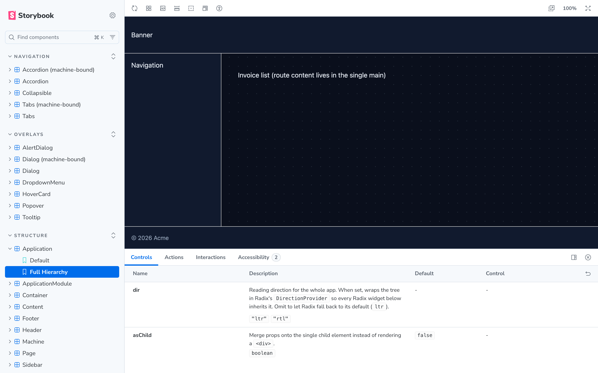

# @dna/ui-library

A **prototyping library** for standing up coherent React apps fast: structural
primitives up to the app level, composable components for state-machine UIs, and
a full Radix widget set — **visually sound out of the box yet fully skinnable**.
Built on [Radix UI](https://www.radix-ui.com/) primitives, documented and
developed with [Storybook](https://storybook.js.org/).

> **Architecture:** a headless behavior core plus an *opt-in* default skin, in
> three independently swappable layers:
> 1. **Behavior** — components built on Radix; behaviour + accessibility + stable
>    styling hooks (`data-ui-*` attributes, forwarded `className`/`style`), and
>    **no bundled visual styling**.
> 2. **Tokens** — `--ui-*` CSS custom properties (`@dna/ui-library/styles.css`).
> 3. **Default skin (two interchangeable paths)** — either the plain stylesheet
>    `@dna/ui-library/skin.css` (`[data-ui-*]` selectors) **or** the Tailwind
>    plugin `@dna/ui-library/tailwind` (maps the same `--ui-*` tokens into
>    Tailwind's theme). Both consume only tokens; pick whichever fits your stack.
>
> Take the behavior alone (headless), add a skin (finished look), or override
> tokens (reskin both paths at once) — without editing component source. This is
> shadcn/ui's token-and-variant *philosophy* without its copy-paste distribution:
> we stay a versioned, deduped npm package. See [Component conventions](#component-conventions).

## The default look: a prototype engine

The default skin is deliberately a **dark wireframe / blueprint** aesthetic — a
dotted canvas grid, dashed "scaffold" borders, mono annotations, and teal
selection highlights (palette from [dna.codes](https://dna.codes)). It reads as a
*working skeleton*, signalling "this is structure + behaviour, not finished
design." The intent is that teams keep the structure and state machine, then make
it theirs — including swapping in a light theme by overriding the surface/text
tokens.

The `Application` shell composed from structural primitives (`Header`, `Sidebar`,
`Content`, `Page`, `Footer`) in Storybook, where every primitive and
state-machine component is documented and exercised — the default wireframe skin
out of the box:



Conventions baked into the skin:

| Convention | Meaning |
| ---------- | ------- |
| Dashed borders | scaffolded structure (not finalized) |
| Dotted canvas grid | the prototype "surface" (drawn behind `Application`) |
| `data-ui-planned` | add to **any** element to flag not-yet-built work (dotted outline + "planned" tag) |
| Hatched `Skeleton` | placeholder content |
| Teal highlight / ring | the current selection / active state |

Two ways to evolve it — both are token-only, no component changes:

```css
:root {
  /* RE-BRAND: point the palette at your colors */
  --ui-color-primary: #7c3aed;
  /* PRODUCTIONIZE: drop the wireframe cues */
  --ui-border-style: solid;
  --ui-canvas-grid: none;
}
```

### The DNA.codes theme (productionized, light + dark)

Both evolution levers above are already done for you in a shipped, named theme:
**`@dna/ui-library/dna.css`**. It is the productionized DNA.codes brand — solid
borders, no canvas grid — in two WCAG-AA-validated modes selected by a
document-level `data-theme` signal. Pair it with the skin instead of importing
`styles.css`:

```tsx
import "@dna/ui-library/dna.css";  // brand tokens, both modes, productionized
import "@dna/ui-library/skin.css"; // the look, keyed off the [data-ui-*] hooks
```

```html
<html>                      <!-- dark mode (the default) -->
<html data-theme="dark">    <!-- dark mode (explicit) -->
<html data-theme="light">   <!-- light mode -->
```

For the UI control that flips it, use **`ThemeToggle`** (a Light/Dark/System
segmented control) or the headless **`useTheme()`** / **`setTheme()`** store it
is built on — both write `data-theme` and persist the choice. See
[Appearance](#appearance-control).

`data-theme` also works on any element, so a subtree can opt into the opposite
mode (a light card inside a dark app). The theme is **self-contained** — it
defines every `--ui-*` token the skin reads, so the two imports above are all you
need. It stays a **white-label override layer**: every brand value is a `--ui-*`
token, so a consumer overrides any of them (in either mode) *after* the import
with no component-source edits — DNA.codes is just the default. See the
`Theme/DNA.codes` story.

## Tech stack

| Concern        | Tool                          |
| -------------- | ----------------------------- |
| Foundation     | [Radix UI](https://www.radix-ui.com/) primitives (unstyled, headless, accessible) |
| Components     | React 19 + TypeScript         |
| Dev / docs     | Storybook 10 (react-vite)     |
| Build          | Vite 7 library mode + `vite-plugin-dts` |
| Tests          | Vitest 4 + Testing Library    |
| Styling        | Headless components + opt-in tokens, default `skin.css`, **and** a Tailwind plugin (no CSS bundled into components). |
| Lint / format  | ESLint + Prettier             |
| Runtime        | Node 20.19+ (LTS 24 recommended — see `.nvmrc`) |

## Getting started

```bash
npm install
npm run dev        # start Storybook at http://localhost:6006
```

## Scripts

| Script                   | Description                                  |
| ------------------------ | -------------------------------------------- |
| `npm run dev`            | Run Storybook in watch mode.                 |
| `npm run build`          | Type-check and build the distributable library to `dist/`. |
| `npm run build-storybook`| Build a static Storybook site.               |
| `npm test`               | Run the unit tests once.                     |
| `npm run test:watch`     | Run tests in watch mode.                      |
| `npm run lint`           | Lint the codebase.                           |
| `npm run typecheck`      | Type-check without emitting.                 |
| `npm run format`         | Format source with Prettier.                 |

## Project structure

```
src/
  components/
    Button/
      Button.tsx          # component (built on a Radix primitive)
      Button.stories.tsx  # Storybook stories
      Button.test.tsx     # unit tests
      index.ts            # component barrel
  styles/
    tokens.css            # --ui-* design tokens (the skinning surface)
    skin.css              # opt-in default skin (styles the [data-ui-*] hooks)
  tailwind/
    index.ts              # opt-in Tailwind plugin (same tokens → Tailwind theme)
  utils/
    clsx.ts               # classname helper
  index.ts                # public entry point
.storybook/               # Storybook configuration
```

Components ship **no** `.css` file — they are headless. The default look is
delivered by an opt-in skin (plain CSS or the Tailwind plugin); without it, you
style components via the forwarded `className` or their `data-*` hooks.

## Consuming the library

### Headless (bring your own styles)

```tsx
import { Button } from "@dna/ui-library";

export function Example() {
  // Headless: className and data-* are styling hooks you target however you like.
  return (
    <Button className="my-btn" onClick={() => alert("hi")}>
      Click me
    </Button>
  );
}
```

### Visually sound — option A: the default CSS skin

Import the tokens, then the skin. Components render finished; override any
`--ui-*` token to reskin.

```tsx
import "@dna/ui-library/styles.css"; // --ui-* token values
import "@dna/ui-library/skin.css";   // default look, keyed off [data-ui-*]
import { Button } from "@dna/ui-library";

<Button variant="primary" size="lg">Save</Button>; // variant/size emit hooks
```

### Visually sound — option B: the Tailwind plugin

The plugin alone is turnkey — no CSS imports needed:

```js
// tailwind.config.js
const dnaUi = require("@dna/ui-library/tailwind");
module.exports = { plugins: [dnaUi] };
```

It injects the `--ui-*` token values and the **same** default skin as `skin.css`
into Tailwind's `base` layer (always emitted, never purged; your utility classes
— output in the later `utilities` layer — still override it), and maps the
tokens into Tailwind's theme. So you also get token-backed utilities —
`bg-ui-primary`, `text-ui-muted`, `rounded-ui-lg`, `shadow-ui-md`, `z-ui-modal`,
`font-ui` — that re-theme when you override the variables.

The injected tokens + skin are generated from `tokens.css`/`skin.css` at build
time, so no token value is duplicated and the two skin paths never drift. For a
headless (tokens-only) Tailwind setup, skip the plugin and spread its exposed
`themeExtend` into your own config instead.

Every component supports Radix's [`asChild`](https://www.radix-ui.com/primitives/docs/guides/composition)
composition pattern, so you can keep the behaviour while rendering your own element:

```tsx
<Button asChild>
  <a href="/dashboard">Go to dashboard</a>
</Button>
```

`react` and `react-dom` are peer dependencies. `radix-ui` is a runtime
dependency and is externalized from the bundle so apps dedupe a single Radix
instance. The skinning artifacts are all opt-in: `@dna/ui-library/styles.css`
(the `--ui-*` tokens, wireframe defaults), `@dna/ui-library/dna.css` (the
productionized DNA.codes brand theme, light + dark), `@dna/ui-library/skin.css`
(the default CSS skin), and `@dna/ui-library/tailwind` (the Tailwind plugin).
`tailwindcss` is **not** a
dependency of this package — the plugin is dependency-free and only loaded by
consumers who use it.

## Application chrome (GitHub-style)

Four compound components compose the structural primitives into a canonical,
GitHub-style app shell — so apps consume finished chrome instead of re-composing
it. `ApplicationShell` wires the other three into the standard full-page
arrangement. All are headless (the same `Slot`/`data-ui-*` rules as every
component); the default skin lays them out.

| Component | Element / landmark | Parts |
| --------- | ------------------ | ----- |
| `ApplicationShell` | composition (`Application` wrapper; no landmark of its own) | `Root`, `Header` (the banner slot), `Body` (sidebar + main row), `Sidebar`, `Main` |
| `Header` | `<header>` → `banner` | `Root`, `Brand`, `Nav` (primary `navigation`), `Search` (`search` landmark), `Spacer`, `Actions` |
| `NavRail` | `<nav>` → `navigation` | `Root`, `Section`, `Label`, `Item` (active = `aria-current="page"`) |
| `PageHeader` | `<div>` (non-landmark; lives in `<main>`) | `Root`, `Breadcrumb`, `BreadcrumbItem`, `Heading`, `Title`, `Actions`, `Description` |

```tsx
<ApplicationShell.Root>
  <ApplicationShell.Header>
    <Header.Brand>DNA.codes</Header.Brand>
    <Header.Search><Input type="search" aria-label="Search" /></Header.Search>
    <Header.Actions><Avatar><Avatar.Fallback>TK</Avatar.Fallback></Avatar></Header.Actions>
  </ApplicationShell.Header>
  <ApplicationShell.Body>
    <ApplicationShell.Sidebar asChild>
      <NavRail.Root>
        <NavRail.Item href="/overview" aria-current="page">Overview</NavRail.Item>
        <NavRail.Item href="/resources">Resources</NavRail.Item>
      </NavRail.Root>
    </ApplicationShell.Sidebar>
    <ApplicationShell.Main title="Resources">
      <PageHeader.Root>
        <PageHeader.Breadcrumb>
          <PageHeader.BreadcrumbItem href="/">DNA.codes</PageHeader.BreadcrumbItem>
          <PageHeader.BreadcrumbItem asChild aria-current="page"><span>Resources</span></PageHeader.BreadcrumbItem>
        </PageHeader.Breadcrumb>
        <PageHeader.Heading>
          <PageHeader.Title>Resources</PageHeader.Title>
          <PageHeader.Actions><Button variant="primary">New</Button></PageHeader.Actions>
        </PageHeader.Heading>
      </PageHeader.Root>
    </ApplicationShell.Main>
  </ApplicationShell.Body>
</ApplicationShell.Root>
```

See the `Structure/Header`, `Structure/NavRail`, and `Structure/PageHeader`
stories; the `Structure/ApplicationShell` story composes all three into the full
shell.

## Content patterns (GitHub-style)

Three more compound components cover the dense content surfaces.

| Component | What it is | Parts |
| --------- | ---------- | ----- |
| `List` | dense repo/issue-style rows (`<ul role="list">`) | `Root`, `Row` (whole-row link via `asChild`), `Leading`, `Main`, `Title`, `Description`, `Trailing` |
| `EmptyState` | the centered "nothing here yet" placeholder | `Root`, `Icon`, `Title`, `Description`, `Actions` |
| `Command` | command/search palette building blocks | `Dialog` (modal, on Radix `Dialog`) or `Root` (inline), `Input` (combobox), `List` (listbox), `Group`, `Item` (option), `Empty` |

`Command` is a cmdk-style combobox: **filtering is consumer-controlled** (you
render the `Item`s matching your query) while the component owns virtual focus
(`aria-activedescendant`), `↑`/`↓`/`Home`/`End`/`Enter` keyboard navigation, and
pointer hover — over a `role="combobox"`/`listbox`/`option` tree.

```tsx
<Command.Dialog open={open} onOpenChange={setOpen} label="Command palette">
  <Command.Input value={q} onValueChange={setQ} placeholder="Type a command…" />
  <Command.List>
    {results.length === 0 && <Command.Empty>No results.</Command.Empty>}
    {results.map((r) => (
      <Command.Item key={r.id} onSelect={() => run(r)}>{r.label}</Command.Item>
    ))}
  </Command.List>
</Command.Dialog>
```

See the `Content/List`, `Content/EmptyState`, and `Content/Command` stories.

## Appearance control

`ThemeToggle` is the canonical Light / Dark / System appearance control — a
segmented selector built on Radix `RadioGroup` (roving focus + arrow-key
selection, no pointer-API dependency, so it is testable in jsdom). It is bound to
a tiny headless store: selecting an option writes `data-theme` to the document
element (which `dna.css` keys off) and persists the choice to `localStorage`.

Drive appearance from code — without the UI — via the same store:

```tsx
import { ThemeToggle, useTheme, setTheme } from "@dna/ui-library";

<Header.Actions><ThemeToggle /></Header.Actions>;

const { theme, resolvedTheme, setTheme } = useTheme(); // theme: light|dark|system
setTheme("dark"); // imperative, no component needed
```

To avoid a flash of the wrong theme before React mounts, read
`THEME_STORAGE_KEY` in an inline `<head>` script and set `data-theme` up front.
See the `Appearance/ThemeToggle` story.

### Replacing an app's interim compositions

These chrome + content components are the canonical replacements for the
interim, app-local compositions a consuming app stands up before they ship:

| App concern | Interim composition | Canonical component |
| ----------- | ------------------- | ------------------- |
| DNA theme (light/dark) | `theme.css` + `BrandStyle.tsx` | `@dna/ui-library/dna.css` |
| Full app shell | `AppShell.tsx` | `ApplicationShell` |
| Top app bar | `AppShell.tsx` | `Header` |
| Left section nav | `AppShell.tsx` (`Sidebar`) | `NavRail` |
| Page header + breadcrumb | `PageHeader.tsx` | `PageHeader` |
| Dense rows | `Table.*` | `List` |
| Empty state | `Card` placeholder | `EmptyState` |
| Command palette | _not yet built_ | `Command` |
| Theme / appearance toggle | `ThemeToggle.tsx` (segmented `Button`s) | `ThemeToggle` (+ `useTheme`) |

## Component conventions

This library's foundation is a **headless Radix behavior core plus an opt-in
default skin**. Every component MUST follow these rules:

1. **Build on a Radix primitive.** Import from the `radix-ui` package (e.g.
   `import { Dialog, Slot } from "radix-ui";`). For elements Radix has no
   primitive for (like `Button`), use `Slot` to implement the `asChild`
   composition pattern. Never reach for a bespoke implementation when a Radix
   primitive exists.
2. **The component makes no visual decision.** Ship behaviour and accessibility,
   not visuals. Do **not** add a component `.css` file or bundle styling. Expose
   styling hooks instead: forward `className`/`style` and emit stable `data-*`
   attributes (e.g. `data-ui-button`). `variant`/`size`-style props are allowed
   but only emit a hook (`data-variant`, `data-size`) for the skin to target —
   the component itself picks no look. The default look lives in the opt-in
   `skin.css`, keyed off these hooks.
3. **Preserve accessibility.** Rely on Radix's built-in semantics, keyboard
   handling, and ARIA. Don't strip or override roles/attributes Radix manages.
4. **Forward refs and native props.** Use `forwardRef` and spread the rest of
   the props onto the underlying element.
5. **Support `asChild`** wherever the underlying element may need to be swapped.

## Adding a component

1. Create `src/components/<Name>/` with `<Name>.tsx`, `<Name>.stories.tsx`,
   `<Name>.test.tsx`, and `index.ts` (no `.css` file — components are headless).
2. Build it on the appropriate Radix primitive from the `radix-ui` package.
3. Forward `className`/`ref`, spread native props, expose `data-*` hooks, and
   support `asChild` where relevant — see [Component conventions](#component-conventions).
4. Re-export it from `src/index.ts`.
5. Run `npm test`, `npm run typecheck`, and `npm run dev` to verify.

`Button` is the reference implementation — copy its shape when scaffolding new
components.
